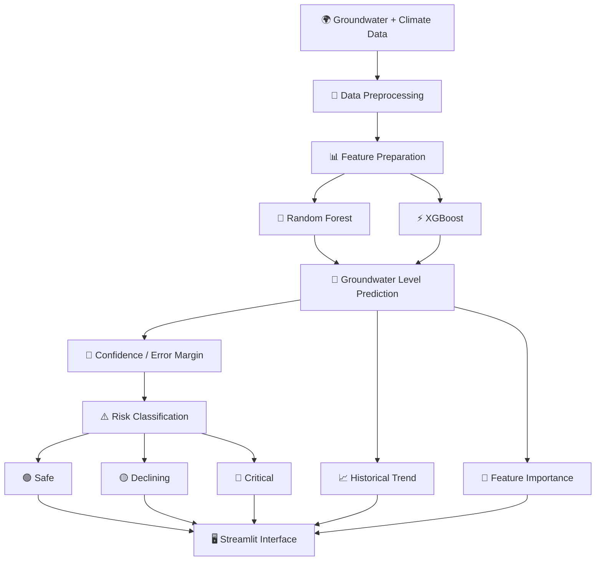
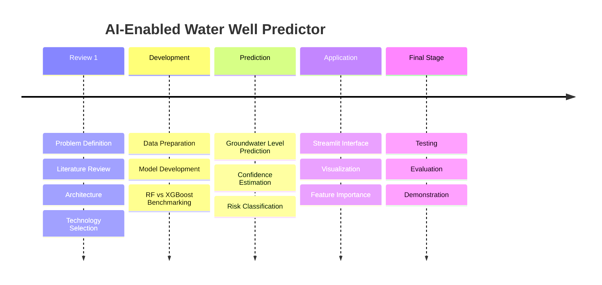

<div align="center">

# 💧 AI-ENABLED WATER WELL PREDICTOR

### *Predicting groundwater levels. Classifying well risk. Enabling smarter water decisions.*

<br>

[](https://github.com/anubhab16/ai-water-well-predictor)
[](https://www.python.org/)
[](https://scikit-learn.org/)
[](https://streamlit.io/)
[](#-project-status)

<br>

**A sensor-free AI/ML solution for groundwater-level prediction and well-risk assessment**

<br>

[🚀 Repository](https://github.com/anubhab16/ai-water-well-predictor)
&nbsp;&nbsp;•&nbsp;&nbsp;
[📖 Research](#-research-foundation)
&nbsp;&nbsp;•&nbsp;&nbsp;
[👥 Team](#-project-team)

</div>

---

## 🌊 Why This Project?

Groundwater is one of India's primary freshwater resources.

Yet traditional well-site assessment can depend on **manual surveys that are slow, resource-intensive, and difficult to scale**.

This project explores a different approach:

> **Can historical groundwater and climate data be transformed into an AI-powered decision-support system that predicts groundwater levels and identifies well risk — without relying on sensors or IoT hardware?**

### Our answer:

**Yes — through machine learning. 🤖**

The proposed system uses historical groundwater and climate data from **1994–2025**, trains and benchmarks **Random Forest** and **XGBoost**, and delivers the results through a **Streamlit interface**.

---

# 🎯 Problem Statement

> **PRJ-314 — Software**

Design and develop a solution for an **AI-enabled water well predictor** using modern technologies to improve:

- ⚡ Performance
- 🤖 Automation
- 🔐 Security
- 📈 Scalability
- 🌍 Real-world usability

**Difficulty:** Medium

---

# 💡 What Does The System Do?

The system follows a simple but powerful pipeline:

```text
        🌍 HISTORICAL DATA
        Groundwater + Climate
                │
                ▼
        🧹 DATA PREPROCESSING
                │
                ▼
        🧠 MODEL TRAINING
        ┌───────┴────────┐
        ▼                ▼
   🌲 Random Forest   ⚡ XGBoost
        │                │
        └───────┬────────┘
                ▼
        🔮 GROUNDWATER
           PREDICTION
                │
                ▼
        🎯 CONFIDENCE /
          ERROR MARGIN
                │
                ▼
        ⚠️ RISK CLASSIFICATION
        ┌───────┼────────┐
        ▼       ▼        ▼
      🟢 Safe 🟡 Declining 🔴 Critical
                │
                ▼
        📊 STREAMLIT DASHBOARD
```

---

# 🧠 Core Intelligence

## 1. 🔮 Groundwater Level Prediction

The model predicts the groundwater level, expressed in **meters**, for a selected station and time period.

## 2. 🎯 Prediction Confidence

The system is designed to provide a **prediction interval / error margin** based on validation performance.

## 3. ⚠️ Well-Risk Classification

Instead of showing only a numerical prediction, the system translates the result into practical categories:

| Status | Meaning |
|:---:|---|
| 🟢 **SAFE** | Favorable well condition |
| 🟡 **DECLINING** | Groundwater condition indicates decline |
| 🔴 **CRITICAL** | High-risk groundwater condition |

## 4. 📈 Historical Trends

Users can visualize historical groundwater behavior to better understand changes over time.

## 5. 🧠 Feature Importance

The system is designed to provide a feature-importance breakdown, making the prediction process more interpretable.

---

# 🏗️ System Architecture



---

# ⚙️ Technology Stack

<div align="center">

| Layer | Technology |
|:---|:---|
| 🐍 **Language** | Python 3.x |
| 📊 **Data Processing** | Pandas, NumPy |
| 🌲 **ML Model 1** | Random Forest Regressor |
| ⚡ **ML Model 2** | XGBoost |
| 📐 **Evaluation** | R², RMSE, MAE |
| 📈 **Visualization** | Matplotlib, Seaborn |
| 🖥️ **Web Interface** | Streamlit |
| 📓 **Development** | Jupyter Notebook / Google Colab / VS Code |
| 🔧 **Version Control** | GitHub |
| 🗃️ **Dataset** | Kaggle — India Groundwater Climate Time-Series |
| 📡 **Special Hardware** | None |

</div>

---

# 📊 Machine Learning Approach

The project specifically explores **tree-based ensemble models** for groundwater-level prediction.

### 🌲 Random Forest

Random Forest provides an ensemble-based regression approach for predicting groundwater levels.

### ⚡ XGBoost

XGBoost provides a gradient-boosting approach that can be benchmarked against Random Forest.

### ⚖️ Why Compare Both?

Existing research does not establish one universally dominant model for groundwater-level prediction.

Therefore, rather than assuming a model is best, this project follows a **benchmarking approach**:

```text
Random Forest
      │
      ├──────► R²
      ├──────► RMSE
      └──────► MAE

             VS

XGBoost
      │
      ├──────► R²
      ├──────► RMSE
      └──────► MAE
```

The better-performing approach can then be considered for the prediction pipeline based on validation results.

---

# 📏 Model Evaluation

The project evaluates model performance using three standard regression metrics:

### `R²`
Measures how well the model explains variation in the target.

### `RMSE`
Measures the magnitude of prediction error while giving greater weight to larger errors.

### `MAE`
Measures the average absolute prediction error.

> 📌 Actual model scores are intentionally not listed here because the Review-1 document does not provide final numerical evaluation results.

---

# 🌐 Streamlit Experience

The final system is designed around a simple interaction:

```text
┌─────────────────────────────────────────────┐
│          💧 WATER WELL PREDICTOR             │
├─────────────────────────────────────────────┤
│                                             │
│  📍 Select Region / Station                 │
│                                             │
│  📅 Select Date / Time Period               │
│                                             │
│             [ 🔮 PREDICT ]                  │
│                                             │
├─────────────────────────────────────────────┤
│                                             │
│  Groundwater Level     🎯 Confidence        │
│                                             │
│      XX.XX m             XX% / ±X.XX        │
│                                             │
│  Risk Status: 🟢 SAFE                      │
│                                             │
├─────────────────────────────────────────────┤
│                                             │
│  📈 Historical Groundwater Trend            │
│                                             │
│  🧠 Feature Importance                      │
│                                             │
└─────────────────────────────────────────────┘
```

---

# 🗃️ Dataset

### 📌 Source

**Kaggle — India Groundwater Climate Time-Series (1994–2025)**

The project uses historical groundwater and climate data covering the period **1994–2025**.

The dataset forms the foundation of:

```text
Historical Data
      ↓
Preprocessing
      ↓
Feature Engineering / Preparation
      ↓
Model Training
      ↓
Validation
      ↓
Prediction
```

---

# 🖥️ System Requirements

| Requirement | Minimum / Recommended |
|:---|:---|
| 💻 Operating System | Windows / macOS / Linux |
| 🐍 Python | 3.8+ |
| 🧠 IDE | Jupyter / Google Colab / VS Code |
| 🧮 RAM | 4 GB minimum / 8 GB recommended |
| ⚙️ Processor | Intel i3 or above |
| 💾 Storage | 2 GB+ free space |
| 🎮 GPU | Not required |
| 📡 IoT / Sensors | Not required |
| 📊 Dataset | Kaggle account |

---

# 🚀 Getting Started

## 1️⃣ Clone the Repository

```bash
git clone https://github.com/anubhab16/ai-water-well-predictor.git
cd ai-water-well-predictor
```

## 2️⃣ Create a Virtual Environment

### Windows

```bash
python -m venv venv
venv\Scripts\activate
```

### macOS / Linux

```bash
python3 -m venv venv
source venv/bin/activate
```

## 3️⃣ Install Dependencies

```bash
pip install pandas numpy scikit-learn xgboost matplotlib seaborn streamlit
```

## 4️⃣ Launch the Application

```bash
streamlit run app.py
```

> ⚠️ The Review-1 presentation specifies Streamlit as the interface technology but does not specify the exact application entry filename. Replace `app.py` if the repository uses another filename.

---

# 📁 Recommended Repository Structure

```text
ai-water-well-predictor/
│
├── 📂 data/
│   └── groundwater_climate.csv
│
├── 📂 notebooks/
│   └── model_training.ipynb
│
├── 📂 models/
│   ├── random_forest/
│   └── xgboost/
│
├── 📂 src/
│   ├── preprocessing.py
│   ├── training.py
│   ├── prediction.py
│   └── risk_classification.py
│
├── 📂 visualizations/
│   ├── trends.py
│   └── feature_importance.py
│
├── 📄 app.py
├── 📄 requirements.txt
├── 📄 README.md
└── 📄 LICENSE
```

> This is a **recommended organization**, not the exact repository structure documented in the Review-1 presentation.

---

# 🌍 SDG 9 Alignment

<div align="center">

### 🌱 Sustainable Development Goal 9

## **Industry, Innovation & Infrastructure**

</div>

The project aligns with the stated SDG-9 direction through its focus on:

**🤖 AI-driven innovation**  
**💻 Software-based infrastructure**  
**💰 Low-cost implementation**  
**📈 Scalability**  
**📡 Sensor-free operation**

The intended outcome is a scalable and accessible tool that can support groundwater-management decisions.

---

# 🗺️ Project Roadmap



---

# 🔮 Future Scope

The project is designed as a foundation for a broader groundwater decision-support system.

Potential future directions include:

- 🗺️ Geographic visualization
- 📍 Larger regional coverage
- 🔄 More frequent data updates
- 🧠 Additional ML model benchmarking
- 📊 Improved confidence estimation
- 🌐 Scalable web deployment
- 🏛️ Integration with groundwater-management workflows
- 📡 Future integration with live data sources

---

# 📚 Research Foundation

The Review-1 presentation references research covering machine learning, deep learning, ensemble methods, and groundwater-level prediction.

### Selected References

1. **Rohde, M. M. et al. (2021)**  
   *A machine learning approach to predict groundwater levels in California reveals ecosystems at risk.*  
   Frontiers in Earth Science, 9, 784499.  
   https://doi.org/10.3389/feart.2021.784499

2. **Davari, S. et al. (2025)**  
   *Application of machine learning algorithms for groundwater level prediction in the Najafabad plain.*  
   Scientific Reports.  
   https://doi.org/10.1038/s41598-025-32376-1

3. **Jesse, G. et al. (2025)**  
   *A systematic review of machine learning models for groundwater level prediction.*  
   Applied Computing and Geosciences, 28, 100303.  
   https://doi.org/10.1016/j.acags.2025.100303

4. **Pham, Q. B. et al. (2022)**  
   *Groundwater level prediction using machine learning algorithms in a drought-prone area.*  
   Neural Computing and Applications, 34, 10751–10773.  
   https://doi.org/10.1007/s00521-022-07009-7

5. **Chen, H.-Y. et al. (2023)**  
   *Groundwater level prediction with deep learning methods.*  
   Water, 15(17), 3118.  
   https://doi.org/10.3390/w15173118

6. **Khan, J. et al. (2023)**  
   *A comprehensive review of conventional, machine learning, and deep learning models for groundwater level forecasting.*  
   Applied Sciences, 13(4), 2743.

7. **Thakur, A. et al. (2025)**  
   *Prediction of groundwater levels using a long short-term memory (LSTM) technique.*  
   Journal of Hydroinformatics, 27(1), 51–68.

8. **Ali, A. S. A. et al. (2024)**  
   *An overview of deep learning applications in groundwater level modeling.*  
   Applied Computational Intelligence and Soft Computing, 2024, 9480522.

9. **Feng, F. et al. (2024)**  
   *Predicting groundwater level using traditional and deep machine learning algorithms.*  
   Frontiers in Environmental Science, 12, 1291327.

---

# 👥 Project Team

<div align="center">

## 🧑‍💻 THE TEAM BEHIND THE PROJECT

</div>

| 👤 Member | 🎓 Roll Number | 💼 Contribution |
|:---|:---:|:---|
| **Anubhab Parashar** | `20231COM0043` | 🤝 Project Team Member |
| **Aman Kundu** | `20231COM0088` | 🤝 Project Team Member |
| **Avdhesh Ghansela** | `20231COM0082` | 🤝 Project Team Member |

### 🤝 Three Members. One Vision.

> **Turning groundwater data into actionable intelligence.** 💧🧠

---

# 👨‍🏫 Project Supervision

### **Mr. Muthuraj V**
**Associate Professor**  
School of Computer Science and Engineering  
Presidency University

### Academic Coordination

| Position | Name |
|:---|:---|
| 🎓 HoD / Team Leader | **Dr. Gopal K Shyam** |
| 📋 Program Project Coordinator | **Ms. Sumita Guddin** |
| 🏫 School Project Coordinator | **Mr. Muthuraju V** |
| 🔢 Panel | **25** |

---

# 🎓 Academic Details

**University:** Presidency University  
**School:** School of Computer Science and Engineering  
**Program:** B.Tech. Computer Engineering (Artificial Intelligence & Machine Learning)  
**Course:** Mini Project — CSE7102  
**Project ID:** PRJ-314  
**Review:** Review-1  
**Date:** 29 August 2026

---

# 📌 Project Status

<div align="center">

### 🟢 REVIEW 1

**Problem ✔️**  
**Literature Review ✔️**  
**Architecture ✔️**  
**Technology Selection ✔️**  
**Expected Output ✔️**

### 🚧 Development in Progress

</div>

---

# ⭐ Why This Project Matters

```text
          TODAY
            │
            ▼
   🌊 Groundwater Data
            │
            ▼
        🤖 AI / ML
            │
            ▼
      🔮 Prediction
            │
            ▼
      ⚠️ Risk Insight
            │
            ▼
      🧠 Better Decisions
            │
            ▼
      🌍 Sustainable
       Water Management
```

The goal isn't simply to **predict groundwater levels**.

The goal is to make those predictions **understandable, actionable, scalable, and useful for real-world decision-making.**

---

<div align="center">

# 💧 Predict Smarter.
# 🌱 Manage Better.
# 🌍 Protect Tomorrow.

<br>

### Built with

**🐍 Python · 🧠 Machine Learning · 📊 Data · 🌊 Groundwater · 🤝 Teamwork**

<br>

[](https://github.com/anubhab16/ai-water-well-predictor)

<br><br>

**PRJ-314 · CSE7102 · Presidency University**

</div>
